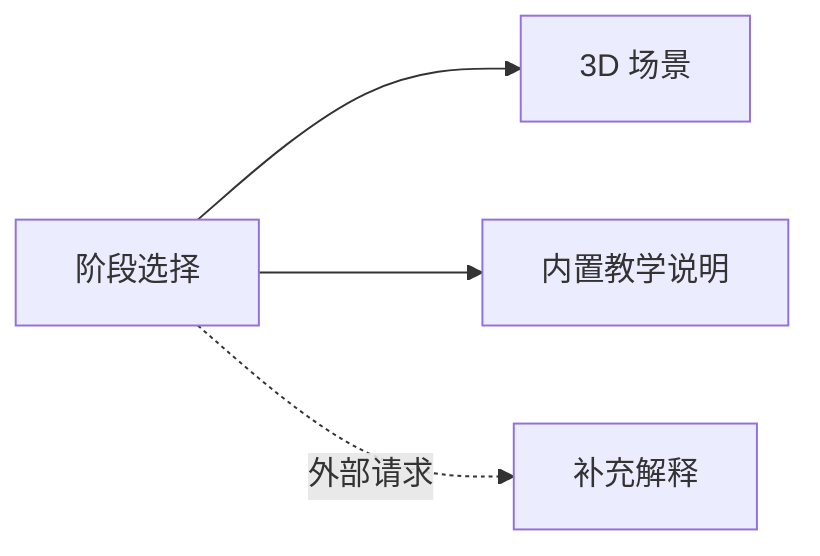

<div align="center">

# LLM Inside · 3D Visualization

沿着词元、向量、Transformer 与输出预测，观察大语言模型的概念流程。


[本地运行](#本地运行) · [学习路径](#学习路径) · [技术结构](#技术结构) · [模型调用与边界](#模型调用与边界)

</div>

基于 React、React Three Fiber、Drei 与 Three.js 的模型原理教学可视化。页面以 3D 场景配合阶段说明，按概览、词元化、嵌入、Transformer、输出预测组织学习路径，并通过外部模型提供补充解释。

这是概念演示，不会在浏览器中加载一个真实大模型，也不展示某个闭源模型的真实内部参数或运行轨迹。

## 本地运行

准备与 [package.json](./package.json) 中依赖兼容的 Node.js/npm，以及支持 WebGL 的浏览器。

```sh
git clone https://github.com/alanbulan/LLM3D-.git
cd LLM3D-
npm install
npm run dev -- --host 127.0.0.1
```

默认端口为 `3000`，以终端输出为准。开发参数限制本机监听；不要将带有开发密钥的服务直接暴露到局域网或公网。

| 命令 | 用途 |
| --- | --- |
| `npm run dev -- --host 127.0.0.1` | 启动开发服务 |
| `npm run build` | 生成前端产物 |
| `npm run preview -- --host 127.0.0.1` | 预览已构建的页面 |

当前脚本不包含独立测试命令，Vite 构建也不代替全部类型检查、教学内容核对和浏览器验收。

## 学习路径

| 阶段 | 界面组织的概念 |
| --- | --- |
| 概览 | 输入到输出的模型流程 |
| Tokenization | 文本切分与 token ID |
| Embedding | 词元到向量的映射 |
| Transformer | 注意力、前馈与残差等模块 |
| Prediction | 输出得分、概率与采样示意 |

具体模型的分词、结构、位置编码和采样策略可能不同。这里的文案和形状用于解释概念，不是所有模型的统一精确实现。

## 技术结构

[App.tsx](./App.tsx) 定义阶段、前后切换和解释请求；[Visualizer3D](./components/Visualizer3D.tsx) 负责可视化；[geminiService](./services/geminiService.ts) 调用外部解释服务；[vite.config.ts](./vite.config.ts) 管理开发与客户端构建配置。



## 模型调用与边界

阶段切换会在短暂延迟后请求补充解释，首次进入也可能发起请求。配置可用密钥后，应关注调用频率与额度；不要误以为浏览模型流程就完全没有外部请求。

开发环境变量名为 `GEMINI_API_KEY`。当前 Vite 配置会将引用的密钥注入浏览器代码，这不是服务端密钥保管。不要提交真实环境文件，也不要发布含共享密钥的静态产物。公开多人使用应另行配置服务端鉴权、限额和安全代理。

模型返回的解释与画面中的静态文案都需要核对。应用未配置本地模型权重、训练过程或真实 tokenizer 服务，因此不能把动画当成一次真实模型推理的测量结果。原 AI Studio 模板可从 Git 历史查看。
